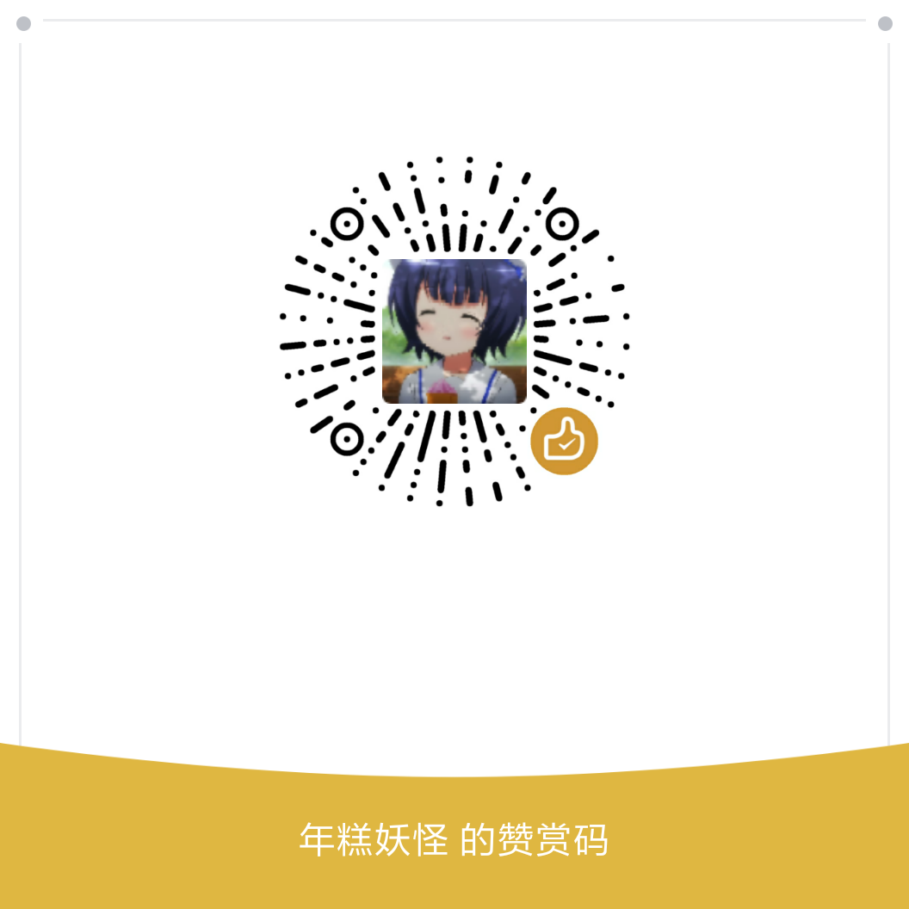

## 想要增强您的 Blessing Skin 或为现有插件贡献？

马上开始 [阅读文档](https://bs-plugin.netlify.com/)，学习开发 Blessing Skin 插件。

## 支持我

目前我只能利用我的闲余时间来编写和维护这份文档，如果您觉得这份文档不错，不妨赞助我，让我写出更高质量的 Blessing Skin 插件开发文档。

赞助时可以在留言中作个备注，以便写在下方的列表中表示感谢。

### 赞助码

  
  &nbsp;&nbsp;
  

