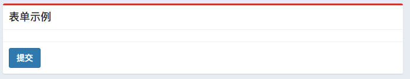
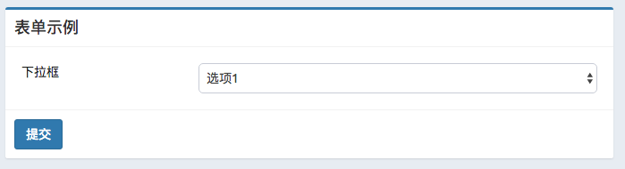

# 表单

[[toc]]

Blessing Skin 使用了 AdminLTE 作为 UI 框架，因此页面中的表单能够得到很好的美化。而 Blessing Skin 提供了 `OptionForm` 类和 `OptionFormItem` 类，这两个类可以帮我们快速生成具有 AdminLTE 风格的表单，而事实上 Blessing Skin 内部也在广泛地使用这两个类。

`OptionForm` 类用于生成表单，而 `OptionFormItem` 类则用于生成表单中的各个表单项。

## 创建一个表单

您既可以在控制器中创建一个表单，然后将这个表单渲染后传递给视图，也可以直接在视图中嵌入一段 PHP 代码来创建表单。

创建表单非常简单，您只需调用 `Option` Facade 的 `form` 方法。`form` 方法接收三个参数。第一个参数是表单的名称（但不是在页面中显示的标题），它必须是唯一的。第二个参数是标题，这人标题将在页面中显示，可以重复。第三个参数是一个回调函数，回调函数接收一个类型为 `App\Services\OptionForm` 的参数。

创建表单的代码如下：

```php
$form = Option::form('my_form', '表单示例', function ($form) {
    //
});
```

您可以在第二个参数中使用 `OptionForm::AUTO_DETECT`，这样 Blessing Skin 会根据您的表单的唯一名称去语言文件中寻找相应的多语言文本，并以此作为标题。

## 生成表单

通过上面这样的方式创建表单后，您需要生成表单：

```php
$form->handle();
```

只有调用表单上的 `handle` 方法才能让表单接收 POST 请求来响应数据更改。

## 渲染表单

调用 `handle` 方法仅仅是生成表单，但此时页面上还没有任何的显示，因为我们还没有渲染表单。

`OptionForm` 实例上提供了多种方法可以让我们渲染出有不同特性的表单，但无论如何，最后必须调用 `render` 方法来生成表单的 HTML。

下面是个简单的例子：

```html
{!! $form->render() !!}
```

您应该在视图中使用如上的代码，因为 `render` 方法将返回表单的 HTML。也正是因为这样，我们需要避免让 Laravel 的模板引擎对生成的 HTML 进行转义。（使用双花括号 `{{ }}` 会对内容进行转义，使用 `{!! !!}` 则不会）

渲染后的表单在页面中会有如下显示：


默认情况下，Blessing Skin 会对表单中各个表单项使用 `<table>` 元素进行排版。如果您不希望这样做，可以调用表单实例的 `renderWithoutTable` 方法。不过通常不建议这么做。

```php
$form->renderWithoutTable();
```

通常，每个表单项会有它的标题和对应的输入框，如果您希望只显示输入框而不显示左边的标题，那么可以调用表单实例的 `renderInputTagsOnly` 方法。

```php
$form->renderInputTagsOnly();
```

另外，您还可以通过调用 `renderWithoutSubmitButton` 方法来取消对「提交」按钮的渲染：

```php
$form->renderWithoutSubmitButton();
```

## 生命周期钩子

每个表单实例都提供了生命周期钩子，您可以利用这些钩子对表单作一些干预。

### 表单渲染前

您可以调用表单实例上的 `always` 方法，并向其传入一个回调函数。表单会在渲染前执行这个回调函数。如：

```php
$form->always(function ($form) {
    // $form 参数就是这个表单实例
});
```

### 表单处理 POST 请求前

您可以调用表单实例上的 `before` 方法，并向其传入一个回调函数。表单会在处理 POST 请求前执行这个回调函数。如：

```php
$form->before(function ($form) {
    // $form 参数就是这个表单实例
});
```

### 表单处理 POST 请求后

您可以调用表单实例上的 `after` 方法，并向其传入一个回调函数。表单会在处理 POST 请求后执行这个回调函数。如：

```php
$form->after(function ($form) {
    // $form 参数就是这个表单实例
});
```

## 添加消息

您可以向表单中添加一条消息，这条消息会出现在表单顶部。

```php
$form->addMessage('写文档不容易啊');
```


您还可以输出不同类型的消息：

```php
$form->addMessage('写文档不容易啊', 'success');
```


```php
$form->addMessage('写文档不容易啊', 'warning');
```


```php
$form->addMessage('写文档不容易啊', 'danger');
```


## 添加按钮

您可以向表单中添加除了「提交」以外的按钮，添加的按钮将出现在「提交」按钮旁边。您可以调用表单实例上的 `addButton` 方法，并传入一个键值对数组作为参数。

数组中可以存在以下选项，它们都是可以被省略的：

- `style` - 按钮的样式，目前 `style` 支持的值有 `default`、`primary`、`success`、`info`、`danger`、`warning`，默认为 `default`。

- `class` - 添加到按钮上的 HTML classes，类型为数组，而不是字符串。

- `href` - 如果您使用了个选项，那么最终的按钮会被渲染成 `<a>` 元素而不是 `<button>` 元素，同时 `<a>` 元素的链接指向您传递的 `href` 值。

- `text` - 显示在按钮上的文本。

- `type` - 按钮的类型，此选项不可与 `href` 同时使用，仅在渲染成 `<button>` 时有意义。

- `name` - 按钮的 `name` 属性，仅在渲染成 `<button>` 时有意义。

```php
$form->addButton([
    'style' => 'primary',
    'text' => '点我'
]);
```


## 传递数据

由于一个表单在 Blessing Skin 也是一个视图，因此您也可以向其传递数据，调用 `with` 方法即可，用法与视图的 `with` 相同。

## 设置表单边框类型

调用 `type` 方法可以设置表单边框的样式。

```php
$form->type('info');
```


```php
$form->type('success');
```


```php
$form->type('warning');
```


```php
$form->type('danger');
```



```php
$form->type('default');
```


## 添加控件

表单中少不了的自然是控件，表单实例上有一系列方法可以让您添加控件。每个控件方法的第一个参数都是它在 `options` 表中的键，因此您不必关注表单中的数据会保存到哪里——它们会按照控件的名称逐个对应。而第二个参数则是它们显示在表单中的每个表单项的标题，当然您也可以用 `OptionForm::AUTO_DETECT` 让 Blessing Skin 自动从语言文件中寻找对应的翻译文本。

添加控件的代码应该写在 `Option::form` 中的第三个参数即回调函数中，如：

```php
$form = Option::form('my_form', '表单', function ($form) {
    $form->text(/* ... */);
});
```

### 文本输入框

```php
$form->text('my_text', '文本输入框');
```


您可以向文本框中添加占位符：

```php
$form->text('my_text', '文本输入框')->placeholder('占位符');
```


### 复选框

```php
$form->checkbox('my_checkbox', '复选框');
```


您还可以向复选框后面添加标签。

```php
$form->checkbox('my_checkbox', '复选框')->label('标签');
```


### 文本域

```php
$form->textarea('my_textarea', '文本域');
```


您可以指定文本域中有多少行：

```php
$form->textarea('my_textarea', '文本域')->rows(50);
```

### 下拉框

```php
$form->select('my_select', '下拉框')
    ->option('option1', '选项1')
    ->option('option2', '选项2');
```




其中 `option` 方法的第一个参数是该选项的值，这个值会传递到后端并保存到数据库；第二个参数是显示在页面中的文本。

### 文本框组

```php
$form->group('my_group', '文本框组')
    ->text('input1')
    ->addon('至')
    ->text('input2');
```


`text` 方法和 `addon` 方法可以以任意数量搭配使用，没有限制。

## 控件共有的方法

每个控件除了有它们自己的方法外，还有一些共同拥有的方法。这些方法在任何控件上都能使用。

下面的介绍均以文本框为例子。

### `value` 方法

通过 `value` 方法，您可以预先设置控件的值，而不是默认的空或从数据库 `options` 表中已保存的值：

```php
$form->text('t', '文本框')->value('预先设置的值');
```


### `hint` 方法

使用 `hint` 方法可以在表单项的标题右边增加一个问号图标，鼠标悬浮在图标上方时，会有一个气泡提示。

```php
$form->text('t', '文本框')->hint('您可能不知道……');
```


### `format` 方法

利用 `format` 方法，您可以对用户输入的数据进行处理。Blessing Skin 会先执行 `format` 方法中传入的回调函数，再将数据保存到数据库中。

```php
$form->text('t', '文本框')
  ->format(function ($data) {
      // 这里的 $data 参数就是这个表单项的值，而不是整个表单的数据。
  });
```

### `disabled` 方法

禁用控件。禁用后用户无法与控件进行交互。

```php
$form->text('t', '文本框')->disabled();
```


### `description` 方法

这个方法会在控件下方增加一条描述。您可以向这个方法传递 HTML，它不会被转义。

```php
$form->text('t', '文本框')->description('这是一行描述');
```


